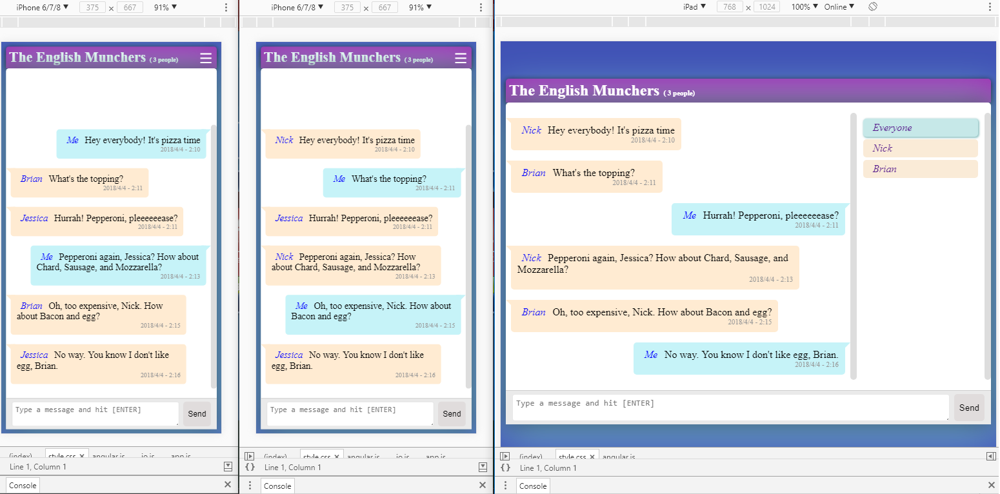

# app
This is a simple app that uses socket io + angularjs v1.2.32.

The client sends a message to the server and the server broadcast this message back.

### TODO:
- [x] Create a new project on Github
- [x] Right now it is only showing the last message. We need it to list all the messages sent in a session. It could be a list `ul > li`.
- [x] Add the date and time for each message.
- [x] Add a validation, don't let the user hit send if there nothing to be sent.
- [x] The current implementation it is only broadcasting the message to the sender, make it broadcast the message to all the users that have the app opened.
- [x] Make it looks like chat app.

#### Plus:
- [x] Allow the users to have a nickname.
- [x] Allow the users to enter a room name.
- [x] Make it pretty.

### TODO(update):
1) [ ] Fix close button icon size
2) [ ] Fiz messages animation:
        When the user clicks the close icon all messages animation. Prevent them from doing so.
3) [ ] Refactor io.services
4) [ ] Allow users to send public messages others in the same room. Now they can only send messages to everyone or private messages to another user.
    The message should apper like this: 
    Mike to Brian : Hi, Brian

    When a user choose to talk privatly to another user a new view(room) show be created.
5) [ ] For distante future: Allow the user to use or upload an avatar

## Running

You will need `node` and `npm`.

### server
it will use the port 3696
*run:*
`cd server`
`npm install`

### client
it will use the port 8012
*run:*
`cd app`
`npm install`

### Now run:
`npm start`
open http://localhost:8012
